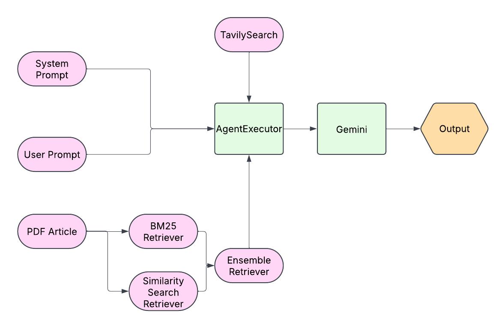
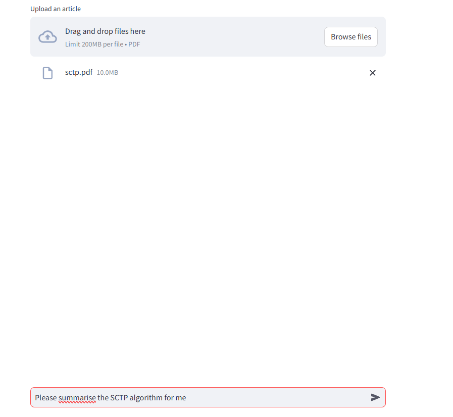
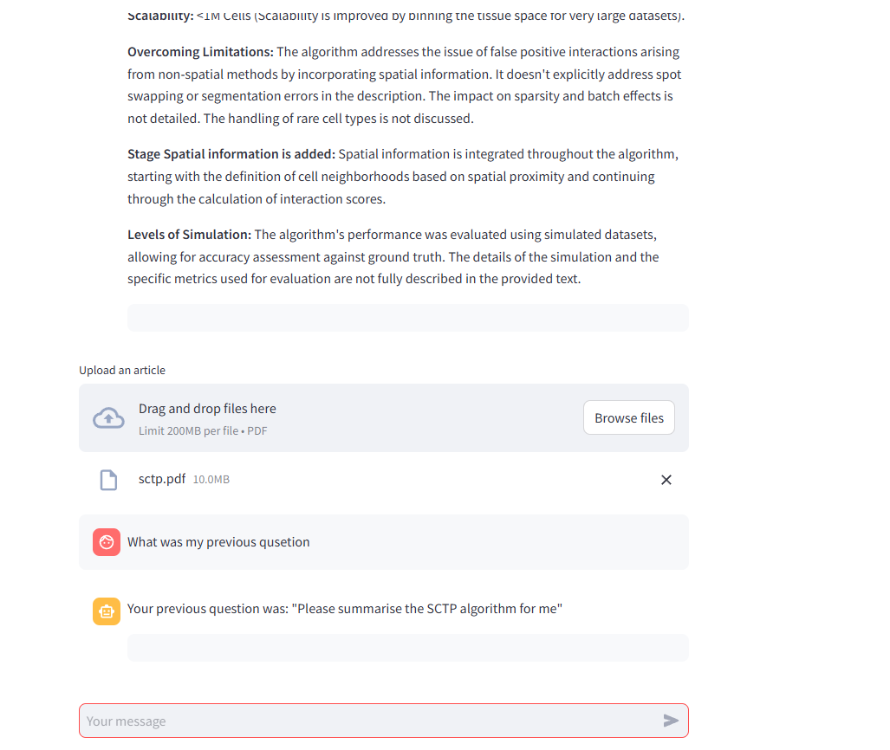

# Aim and Introduction 
This research project seeks to answer the following question: "Is it possible to create an agent that can understand and summarise the literature of spatial clustering methods employed in the field of spatial transcriptomics?" I plan to answer this by creating my own LLM agent and comparing it against other existing LLM models. I improved the agent by employing RAG (Retrieval Augmented Generation) and specialised web search engine Tavily as tools for the Agent. Additional system prompts also were used to help guide the Agent for the nature of its responses. Evaluation of the agent was performed by comparing a large spreadsheet of various metrics and categories for each spatial clustering method generated from human experts against the results generated by the agent. Additionally, combinations of the agent with its tools has been analysed to assess their impacts, and finally a comparison of the agent against the end-user application of ChatGPT was performed.

# Methods
The LLM Agent was developed using the Langchain framework, which allows for flexible abstractions during the development process. Langchain allows for easy integration of new features such as the use of embedding models for RAG and an AgentExecutor using the ReAct (Reasoning and Acting) Agent for a useful interface for helping the agent choose a relevant tool when coming up with a response. 

```{r, fig.cap="Diagram of the Agent Execution Process, Curved Boxes represent inputs used by the AgentExecutor that creates plans and determines actions to be used in execution. This is sent to GeminiAPI, which then performs"}

```


## Model Selection
Google Gemini Flash was chosen as it has a free to use API with a large number of tokens available for use. Local Models were not used due to limited computational resources making even the smaller models take too long to perform document retrieval tasks. Though OpenAI was also considered as a model choice, their API required a subscription fee.

## System Prompt
The system was provided with a prompt that informs it that it is an assistant capable of answering various topics, from simple topics to deep discussions. It is also told to act as a spatial transcriptomics expert, and that answers should be kept technical, but concise. 

Additional system prompts include the definitions of various categories for each spatial algorithm as determined by human experts which can be seen [here](https://docs.google.com/spreadsheets/d/1P1-Nw0i_MpLoE8he1H7ZT-acYd4jOgDPrKZBxR-L6dw/edit?gid=0#gid=0). This ranged from things such as clustering method (Bayesian, Graph-based, Autoencoder, Centroid, Hierarchical-based), Scalability, Assumptions, Input data, programming language and metrics + simulations employed in the article. See the `prompts.py` file for more information regarding the specific details.

## Information Review Sheet
The spatial information review sheet had its categories filled in by 2 domain experts. On top of discrete categories, various columns of the sheet also contained details of the experts' thoughts of the algorithm on things such as realism, additional datasets, and comments.

## RAG Process
The RAG process begins by taking in a scientific article in the form of an input pdf file by loading it using the PyPDFLoader package. It is then broken down into several chunks using a RecursiveTextCharacterSplitter to improve proccessing efficiency, this can then be converted to vectors via an embedding model. The vectors are then stored in a Chroma vector database, which can be fetched from the LLM via a document retriever. A document retriever attempts to find the most relavant information in relation to a user query (In this case, the user's question). To improve the RAG process, an ensemble retriever was used consisting of the following: The first retriever uses a vector similarity search from the Chroma vector database by looking at vectors that were closer to the query in a high dimensional space. The second is a BM25 retriever which ranks the best match 25 chunks based on relevance to the given query.

## Tavily Search
Tavily Search API is a web search engine API that can be used by an LLM during the processing stage, it searches the web for additional relevant webpages by using the context of the user query. This helps fill in gaps and allows the Agent to infer certain details when the information of the article is insufficient for answering its questions. (I.e. Accessing the source code of the algorithm via public GitHub repository)

# Evaluation
With all this in mind, we can now discuss the methodology for evaluation.

## Data Collection
Five different methods were evaluated:

1. The Agent with all tools available.
2. The Agent without Tavily Search.
3. The Agent without document retrievers.
4. The Agent with no tools available
5. ChatGPT's end-user interface.

In each of these methods, a scientific article of a spatial clustering method was provided, along with a user prommpt that tells the agent to categorise the spatial clustering method all the fields as described in the **System** Prompt section. With the following structure:

`<Category>,<Answer>`

Each result was stored in the form of a csv file under the file structure <method_name>/<article_name>.csv. For accessing the ChatGPT end-user application, Selenium was used to simulate an end-user entering the system prompt along with a prompt asking it to summarise a spatial clustering method.

This process was repeated until all 5 methods contained all csvs.

## Data Loading
Dataframes were created by accessing each directory and reading each individual csv file. The csvs were transposed and added into a dataframe one row at a time. Once all csvs were retrieved and appended, an additional column specifying the LLM method was added to the dataframe.

For the spatial clustering information sheet- the Google Sheets was directly read, specifying ranges with discrete values. And since currently the sheet is still under review, duplicate entries were removed from the dataset.

## Comparisons 
To obtain the comparison between information sheet and agent output, column names were matched so that the dataframes could be joined.

Correctness of the agent was measured by counting the number of matching entries from the ground truth and agent.

# Results
We can see from figure 1 that overall, all variants of the agent with access to tools demonstrated better performance compared to the ChatGPT browser application. We also see that the general performance of the LLMs remained fairly stable across five different runs. We see that the loss of the RAG component of the LLM causes a decrease in stability and performance, depicted by the lower correctness percentage in the purple boxplot.

```{r, suppressMessages = TRUE, include = FALSE}
library(tidyverse, quietly = TRUE)
library(reactable)
# Loading the resulting dataframes from analysis.py
sim1 = read.csv("data/sim1.csv")
sim2 = read.csv("data/sim2.csv")
sim3 = read.csv("data/sim3.csv")
sim4 = read.csv("data/sim4.csv")
sim5 = read.csv("data/sim5.csv")
```


```{r, fig.cap = "Boxplots depicting Correctness of LLM and Agent against Ground Truths in the Spatial Clustering Information Sheet, Agentic methods generally performed better than ChatGPT's end user application."}
all_sim = do.call("rbind", list(sim1, sim2, sim3, sim4, sim5))
all_sim$Correct_Percent = as.numeric(all_sim$Correct_Percent)
all_sim2 = all_sim
all_sim2$Method = factor(all_sim2$Method, levels = c("pdf_out", "search_out", "agent_out","gpt_out"))
all_sim2$Method = plyr::revalue(all_sim2$Method, c("pdf_out" = "Agent + PDF", "search_out" = "Agent + Search", "agent_out" = "Agent + Search + PDF", "gpt_out" = "GPT"))

ggplot(all_sim2, aes(x = Method, y = Correct_Percent, fill = Method)) + geom_boxplot() + theme_bw() + ylab("Correct (%)") + ggtitle("LLM correctness (%) against Expert Ground Truths in Spatial Clustering Sheet.")
```
When looking at the performance for individual categories, we see a few trends

- Generally, LLMs did a good job with categorising the methods used and the software side of things, I.e. Vignette, Packages, etc. (GPT struggled with Packages though)
- The correctness of LLMs remained fairly stable throughout five runs of evaluation, depicted by the the small spread of each boxplot in Figure 2.
- All methods heavily struggled with finding out the scalability of each methods, demonstrating correctnesss (%) of below 50% for the most part.
- The Agent with only Search capabilities struggled heavily with figuring out assumptions and simulations.

```{r}
logic_df = all_sim %>% select(-c(X, Algorithm, Correct_Percent, Correct_Terms)) %>% dplyr::mutate(across(everything(), ~  case_when(. == "True"~ TRUE, . == "False" ~ FALSE)))

logic_df$Method = all_sim$Method
df_len = dim(all_sim %>% filter(Method == "gpt_out"))[1]

correct_terms = logic_df %>% group_by(Method) %>% reframe(across(c(where(is.logical))))
correct_terms = correct_terms %>% group_by(Method) %>% summarise(across(where(is.logical), sum)) %>% select(-Source)
correct_terms = correct_terms %>% mutate(across(where(is.integer), function(x){
  100 * x / df_len
}))

round_df <- function(x, digits){
  numeric_columns = sapply(x, mode) == 'numeric'
  x[numeric_columns] = round(x[numeric_columns], digits)
  return(x)
}

rounded_df = round_df(correct_terms, 2)
reactable(rounded_df)


```
# Deployment 
## Approach
The application of the agent has been deployed using Streamlit frmaework on Python and can be accessed [here](https://stllmchat.streamlit.app/). The agent has the following features:

## Retrieval Augmented Generation (RAG)
As described in the Methods section, the Agent is capable of Retrieval Augmented Generation using an input PDF file. This is implemented in the Streamlit application by giving the user the option to upload the file. The LLM will then consider using the information retrieved from this document depending on the question asked.

```{r, fig.cap= "Agent is able to perform RAG using user uploaded pdf files"}

```


## Memory
The Agent has the ability to remember past conversations from the user, this is to allow the model to maintain context to the user's questions.

```{r, fig.cap = "Agent has memory of previous questions and conversations."}

```


# Limitations and Future Work
Since the Agent makes use of various APIs such as Gemini and TavilySearch, the number of tokens becomes a limiting factor for the amount of times the Agent can be used on a monthly basis. Additionally, the Agent struggles with handling specific aspects such as determining scalability and understanding use of simulations in the article. Responses generated from the Agent could sometimes contain no relavant information when asked to answer more specific questions in regards to a spatial clustering method.

Future work can involve investigating agentic workflows using other state-of-the-art LLMs such as Deepseek, Meta-LLama, and OpenAI if the computational resources allow it, supervised fine-tuning of the Gemini Models by creating datasets containing domain expert descriptions of spatial clustering techniques, and performing more thorough evaluations using reference-based metrics such as ROUGE and BERT similarity scores. 


